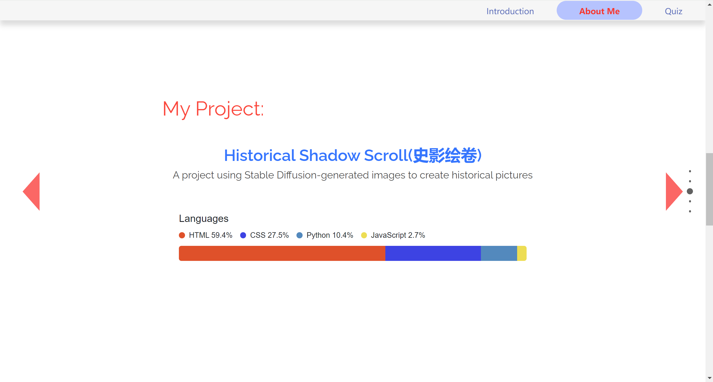
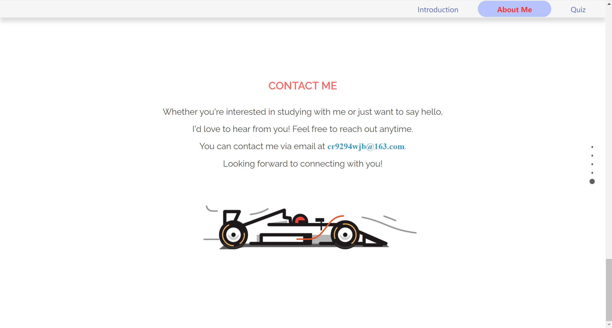
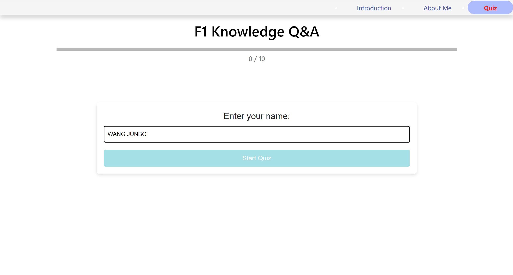
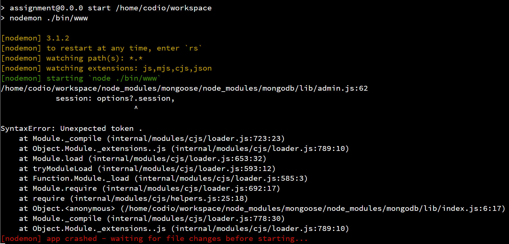

# README

## 1. Introduction

This is a simple website built with Node.js, Express, and Socket.IO. It contains information about yourself and an interactive quiz application system.

### 1.1 Tech Stack

- **Node.js**: A server-side environment for running JavaScript code.
- **Express**: A web application framework for Node.js used to build APIs and handle HTTP requests.
- **Socket.IO**: A library for real-time communication.
- **MongoDB**: A NoSQL database for storing user answers and scores. (Due to version issues, the data is stored on Codio instead)
- **Mongoose**: An object modeling tool for MongoDB in Node.js.
- **EJS**: A template engine for generating HTML pages.
- **Morgan**: An HTTP request logger middleware.

### 1.2 Project Directory

```
/online-quiz
|-- /bin
|   |-- www.js
|-- /data
|   |-- answer.json
|   |-- questions.json
|-- /node_modules
|-- /public
|   |-- /images
|   |-- /javascripts
|   |-- /stylesheets
|-- /routes
|   |-- index.js
|   |-- form.js
|   |-- users.js
|   |-- test.js
|   |-- Answer.js
|-- /views
|   |-- error.ejs
|   |-- index.ejs
|   |-- users.ejs
|   |-- form.ejs
|   |-- test.ejs
|-- app.js
|-- package.json
|-- package-lock.json
|-- README.md
```

### 1.3 Project Structure

The main files and directory structure of the project are as follows:

- `app.js`: The main application file, configuring Express and Socket.IO.
- `routes/`: Contains the application's route modules.
- `views/`: Stores template files, using EJS as the template engine.
- `public/`: Stores static files (such as CSS, JavaScript, and images).
- `data/`: Stores JSON files for application data.

### 1.4 Starting the Server

##### 1. **Install Node.js and npm**

Ensure that [Node.js](https://nodejs.org/) and npm (Node Package Manager) are installed on your system.

##### 2. **Install Dependencies**

Run the following command in the project's root directory to install the necessary dependencies: (already done, generating the node_modules package)

##### 3. **Start the Server**

Run the following command in the project's root directory to start the server:

The server will start at `http://localhost:3000`.

Configure the port number of `BOX URL` to 3000, and click `BOX URL` to launch the interface.

# 2. Server

## 2.1 Introduction

The server for this project is built using the [Express](https://expressjs.com/) framework and utilizes [Socket.IO](https://socket.io/) for real-time communication. The main functionalities of the server include handling HTTP requests, serving static files, storing and reading data, as well as processing user-submitted answers and generating leaderboards.

## 2.2 Main Features

1. **Routing**

   - `/`: Home route.
   - `/form`: Form submission route.
   - `/users`: User-related route.
   - `/test`: Test route.

2. **Static File Serving**

   Serving static files from the `public` directory using the `express.static` middleware.

3. **Data Storage**

   Using the `fs-extra` module to store user-submitted answers in the `data/answers.json` file.

4. **Socket.IO Real-time Communication**

   - Connection and disconnection notifications.
   - Handling user-submitted answers and saving them to a local JSON file.
   - Responding to client leaderboard requests, generating a leaderboard based on user scores, and sending it to the client.

5. **Error Handling**

   - Basic error handling mechanisms are configured, including 404 errors and general error handling.

## 2.3 Main Code

Simplified main code snippet:

```javascript
var express = require('express');
var path = require('path');
var fs = require('fs-extra');
var http = require('http');
var socketIo = require('socket.io');
var app = express();
var server = http.createServer(app);
var io = socketIo(server);

// Functions to read and write JSON files
async function readData() { /* ... */ }
async function writeData(data) { /* ... */ }

app.use(express.static(path.join(__dirname, 'public')));
app.get('/questions', (req, res) => { /* ... */ });

io.on('connection', (socket) => {
  socket.on('answer', async (data) => { /* ... */ });
  socket.on('requestLeaderboard', async () => { /* ... */ });
});

server.listen(3000, () => {
  console.log('Server is running on http://localhost:3000');
});
```

# 3. Page Design

## 3.1 Introduction

This is the homepage of the website, containing welcome information and some interactive elements. The page uses Bootstrap for style and layout optimization, and custom CSS and JavaScript files are introduced to achieve specific effects.

### 3.1.1 File Structure

- `index.ejs`: Template file for the homepage, used to generate the welcome page.
- `style.css` and `index.css`: Stylesheet files for the homepage.
- `script.js` and `index.js`: JavaScript files for the homepage.

### 3.1.2 Page Elements

- **Navigation Bar**: Contains a menu with links to other pages, allowing users to quickly switch to other pages by clicking the navigation bar.

  - `Introduction`: Homepage link, pointing to `/`.
  - `About Me`: Personal introduction page link, pointing to `/users`.
  - `Quiz`: Quiz page link, pointing to `/form`.
- **Welcome Information**:

  - `typing`: A dynamically displayed welcome message area, using JavaScript to control text animation effects.
  - `h1`: Title, displaying the user's name.
- **Illustration Section**:

  - Contains images of two scenarios: indoor and outdoor. Users can switch between different scenarios and corresponding items by clicking options.
- **Option Switching**:

  - `option-wrapper`: Contains two option buttons, representing the user's preferred activity types: “I like staying at home.” and “I also enjoy traveling.”
  - By clicking different option buttons, the page will switch to display the corresponding illustrations and background.

### 3.1.3 Functional Description

- Dynamic Welcome Message:

  - Uses JavaScript and Anime.js to implement a typing effect, dynamically displaying a welcome message when the page loads.
- Scenario Switching:

  - Users can switch between different scenario illustrations by clicking options, using jQuery to listen for click events and switch the displayed content.
- Responsive Design:

  - Uses Bootstrap to implement a responsive design, ensuring the page displays correctly on different devices.

### 3.1.4 Libraries Introduced

- Bootstrap:

  - Used for layout and responsive design.
  - Includes Bootstrap's CSS and JS files.
- Anime.js:

  - Used to achieve animation effects.
- jQuery:

  - Simplifies DOM operations and listens for user interaction events.

## 3.2 About Me

This is an "About Me" page, showcasing personal introduction, skills, projects, photos, and contact information. The page uses a full-screen scrolling effect, implemented with the FullPage.js library.

### 3.2.1 File Structure

- `users.ejs`: Template file for the "About Me" page, used to display personal information and skills.
- `game.css`, `user.css`, `anime.css`, `skill.css`, `contract.css`, `language.css`, `style.css`: Stylesheet files used by the page.
- `fullpage.js`, `main.js`, `nav.js`, `smooth.js`, `typing.js`, `game.js`, `language.js`, `contract.js`: JavaScript files used by the page.

### 3.2.2 Page Elements

- **Navigation Bar**: Contains a menu with links to other pages, allowing users to quickly switch to other pages by clicking the navigation bar.

  - `Introduction`: Homepage link, pointing to `/`.
  - `About Me`: Personal introduction page link, pointing to `/users`.
  - `Quiz`: Quiz page link, pointing to `/form`.
- **Home Section**:

  - Describes who I am.
    
- **About Me Section**:

  - Contains personal introduction, photos, and some hobbies. It also showcases personal skill levels, including proficiency in Python, HTML, CSS, JavaScript, Vue, and other skills.
    
- **Project Showcase**:

  - Displays projects participated in, including project names and brief descriptions.
    
- **Photo Showcase**:

  - Displays photos taken by the user, including location information of the photos.
    
- **Contact Information**:

  - Provides the user's email address, allowing users to contact the author.
    
### 3.2.3 Functional Description

- Full-Screen Scrolling:

  - Uses the FullPage.js library to implement full-screen scrolling, displaying page content in a paginated form.
- Animation Effects:

  - Uses the Wow.js library to implement animation effects for page elements, enhancing the interactive experience.
- Skills Showcase:

  - Uses the Skill Bar effect to showcase personal skill levels, allowing users to intuitively understand the author's skill proficiency.

### 3.2.4 Libraries Introduced

- **FullPage.js:**

  - Used to implement full-screen scrolling effects.
- **Owl Carousel:**

  - Used to create a carousel effect for photo displays.
- **Wow.js:**

  - Used to implement animation effects for page elements.


## 3.3 Quiz

This is an online quiz page about F1 knowledge, containing multiple-choice questions. Users can take the test by entering their name and answering the questions. The page includes a timer, a progress bar, and a leaderboard after completing the quiz.

### 3.3.1 File Structure

- `form.ejs`: Template file for the online quiz page, used to implement the online test.
- `style.css`, `form.css`, `leaderboard.css`, `startquiz.css`: Stylesheets used by the page.
- `form.js`, `script.js`: JavaScript files used by the page.

### 3.3.2 Page Elements

- **Navigation Bar**: Contains links to other pages, allowing users to quickly switch to other pages by clicking on the navigation bar.

  - `Introduction`: Home page link, points to `/`.
  - `About Me`: Personal introduction page link, points to `/users`.
  - `Quiz`: Quiz page link, points to `/form`.
- **Main Content**:

  - **Title**: “F1 Knowledge Q&A”
  - **Quiz Container**: Contains elements like questions, options, countdown timer, and leaderboard.
    
- **Quiz Section**:

  - **Progress Bar**: Shows the user's quiz progress.
  - **Questions and Options**: Displays the current question and its options.
  - **Countdown Timer**: Shows the remaining answering time.
  - **Leaderboard**: Displays the leaderboard after the quiz ends.
    
    

### 3.3.3 Functional Description

- **Initialize Quiz**: Initialize the quiz through the `quizInit` function, display the start screen, and establish a connection with the server.
- **Display Start Screen**: Users enter their name and click the start button to begin the quiz.
- **Start Quiz**: After entering the name, start the quiz, update the progress bar, and render the first question.
- **Render Question**: Update the page content based on the current question and options, and start the timer.
- **Timer Functionality**: Set a 15-second countdown. When time is up or the user answers, display the correct answer and provide a “Next Question” button.
- **Record Answer**: After the user clicks an option button, record the answer and send it to the server, while updating the total score.
- **Display Correct Answer**: When the user answers or time is up, display the correct answer and provide feedback information.
- **Display Next Question Button**: After the user answers or time is up, display the “Next Question” button.
- **Handle Next Question**: After the user clicks the “Next Question” button, render the next question or display the quiz results.
- **Display Results**: Display the user's quiz results, including user ID, name, and total score, and request leaderboard data from the server.
- **Display Leaderboard**: Fetch leaderboard data from the server and display it on the page.

### 3.3.4 Libraries Used

- **Bootstrap CSS**:

  - Used for page layout and styles.
- **jQuery**:

  - Used to simplify JavaScript operations.
- **Socket.IO**:

  - Used to implement real-time communication functionality.
- **Popper.js and Bootstrap JS**:

  - Used to implement some interactive effects.


# 4. Version Control

By pushing the project to GitHub and using Git for version control, you can effectively manage the project's code versions, avoiding conflicts and confusion during development.

## 4.1 Overview

This project includes a configuration folder `.idea` for the development environment, created by JetBrains series IDEs such as IntelliJ IDEA, used to store project configuration information. The version control of the project is indicated by the `.gitignore` and `vcs.xml` files. The project is using Git for version control and is also pushed to a GitHub remote repository for version control management.

## 4.2 File Description

1. **.gitignore**
   - Lists the files and directories that should be ignored by Git to avoid submitting these unnecessary files to the version control system.
2. **assignment.iml**
   - IntelliJ IDEA module file, containing configuration information of the project module.
3. **inspectionProfiles**
   - Contains code inspection configuration files, defining rules for code style, error detection, and other code quality checks.
4. **jsLibraryMappings.xml**
   - Defines the mapping of JavaScript libraries used for web development projects, helping the IDE recognize and handle JavaScript dependencies.
5. **material_theme_project_new.xml**
   - Related to the UI theme settings of the project, defining the material theme used by the project.
6. **modules.xml**
   - Contains information about various modules in the project, used for organizing and managing the modular structure of the project.
7. **vcs.xml**
   - Contains configuration information for the version control system, indicating the version control system used by the project (e.g., Git).
8. **webResources.xml**
   - Contains configuration of web resources, specifying various web resources used in the project (such as HTML, CSS, JavaScript files, etc.).

## 4.3 Version Control Strategy

1. **Using the .gitignore File**
   - Ensure the `.gitignore` file includes all files and directories that should not be submitted to the repository. For example:

     ```gitignore
     # IntelliJ IDEA
     .idea/
     *.iml

     # Compiled output
     /out/
     /build/

     # Log files
     *.log

     # OS generated files
     .DS_Store
     Thumbs.db
     ```

2. **Commit Message Specification**
   - Use meaningful commit messages to facilitate later maintenance and version tracing. For example:
     ```bash
     git commit -m "Fix bug in user authentication"
     ```

3. **Regular Push and Pull**
   - Regularly push local changes to the GitHub remote repository and pull updates from the remote repository to ensure consistency of the codebase.


# 5. Difficult Points

To avoid compatibility issues with the MongoDB package due to Node.js version problems, we decided to use the `fs-extra` module for local storage. MongoDB depends on specific versions of Node.js, and if the Node.js version does not match the MongoDB package version, it may cause the project to fail to run properly or result in various compatibility errors.

## Error Message

From the error message, it can be seen that the error occurs when loading the `mongodb` module, especially a syntax error appears when parsing JavaScript code. This error may be due to the fact that the code MongoDB depends on uses syntax features not supported by the current version of Node.js, causing it to fail to parse and run correctly in the current environment.

By using `fs-extra` for file system operations, we can completely bypass this dependency issue. `fs-extra` is a lightweight file system operation library with broader and more stable compatibility with Node.js versions. In this way, we can ensure the reliability and consistency of data storage and retrieval, avoiding unnecessary troubles caused by dependency library version conflicts.

Additionally, using `fs-extra` simplifies the development and deployment process. We no longer need to worry about compatibility issues between MongoDB and Node.js, allowing us to focus more on implementing business logic. At the same time, `fs-extra` provides rich file system operation functions, making file operations more convenient and efficient.

In summary, switching to `fs-extra` for local storage not only solves the compatibility issues between the MongoDB package and Node.js versions but also improves the stability and development efficiency of the system.

# 6. Reference

1. **Node.js Documentation**
   Official documentation for Node.js, providing details on how to set up and use the runtime environment for server-side JavaScript.
   - [Website: Node.js Documentation](https://nodejs.org/en/docs/)

2. **Express Documentation**
   Comprehensive guide and API reference for Express, a popular web framework for Node.js.
   - [Website: Express Documentation](https://expressjs.com/)

3. **Socket.IO Documentation**
   Official documentation for Socket.IO, a library for enabling real-time, bidirectional communication between web clients and servers.
   - [Website: Socket.IO Documentation](https://socket.io/docs/)

4. **MongoDB Documentation**
   Detailed guides and API references for MongoDB, a NoSQL database program.
   - [Website: MongoDB Documentation](https://docs.mongodb.com/)

5. **Mongoose Documentation**
   Official documentation for Mongoose, a MongoDB object modeling tool designed to work in an asynchronous environment.
   - [Website: Mongoose Documentation](https://mongoosejs.com/docs/)

6. **EJS Documentation**
   Documentation for EJS, a simple templating language that lets you generate HTML markup with plain JavaScript.
   - [Website: EJS Documentation](https://ejs.co/#docs)

7. **Morgan Documentation**
   Middleware library for logging HTTP requests in Node.js applications.
   - [Website: Morgan Documentation](https://github.com/expressjs/morgan)

8. **Bootstrap Documentation**
   Official guide and documentation for Bootstrap, a framework for building responsive, mobile-first websites.
   - [Website: Bootstrap Documentation](https://getbootstrap.com/docs/)

9. **Anime.js Documentation**
   Official documentation for Anime.js, a lightweight JavaScript animation library.
   - [Website: Anime.js Documentation](https://animejs.com/documentation/)

10. **jQuery Documentation**
    Comprehensive documentation for jQuery, a fast and feature-rich JavaScript library.
    - [Website: jQuery Documentation](https://jquery.com/)

11. **FullPage.js Documentation**
    Official documentation for FullPage.js, a library to create fullscreen scrolling websites.
    - [Website: FullPage.js Documentation](https://alvarotrigo.com/fullPage/)

12. **Owl Carousel Documentation**
    Documentation for Owl Carousel, a jQuery plugin for creating responsive carousel sliders.
    - [Website: Owl Carousel Documentation](https://owlcarousel2.github.io/OwlCarousel2/)

13. **Wow.js Documentation**
    Official documentation for Wow.js, a JavaScript library for revealing animations when you scroll.
    - [Website: Wow.js Documentation](https://wowjs.uk/docs.html)
