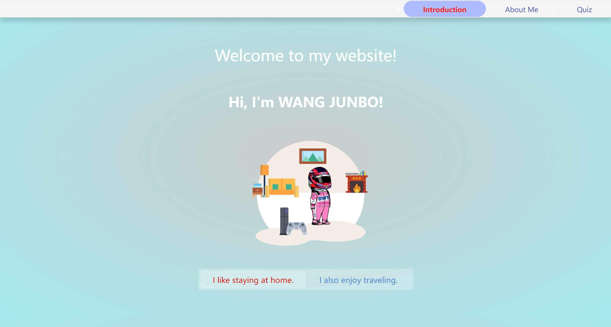
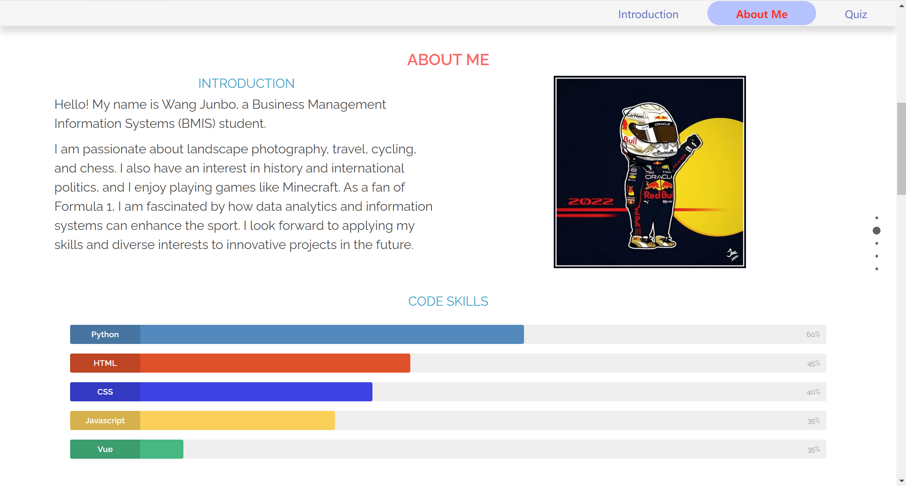
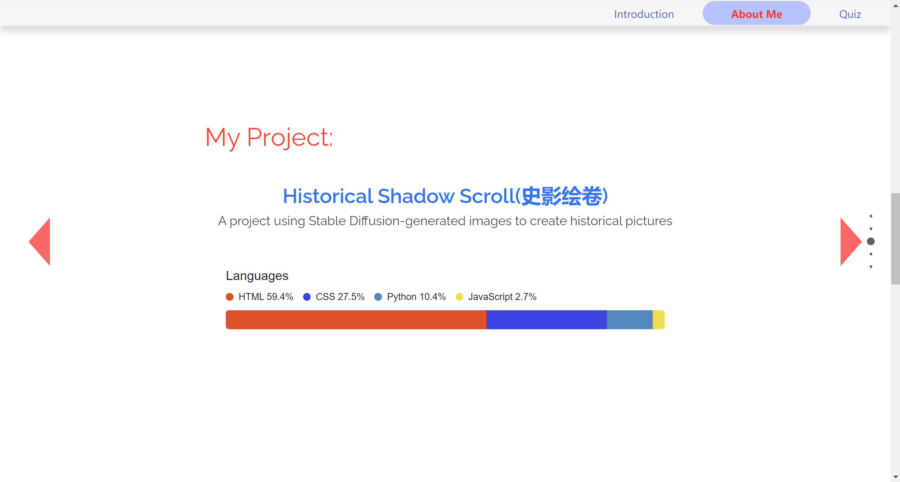
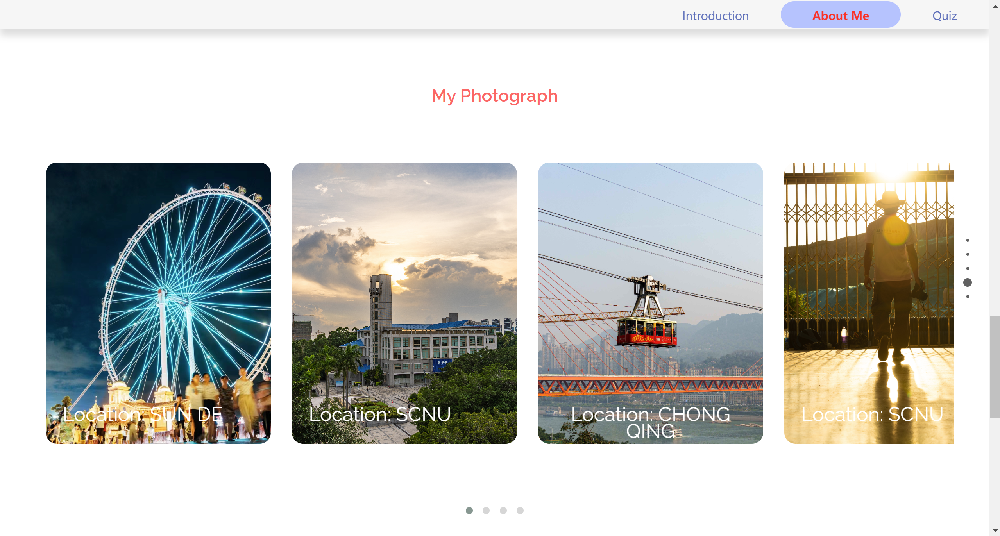
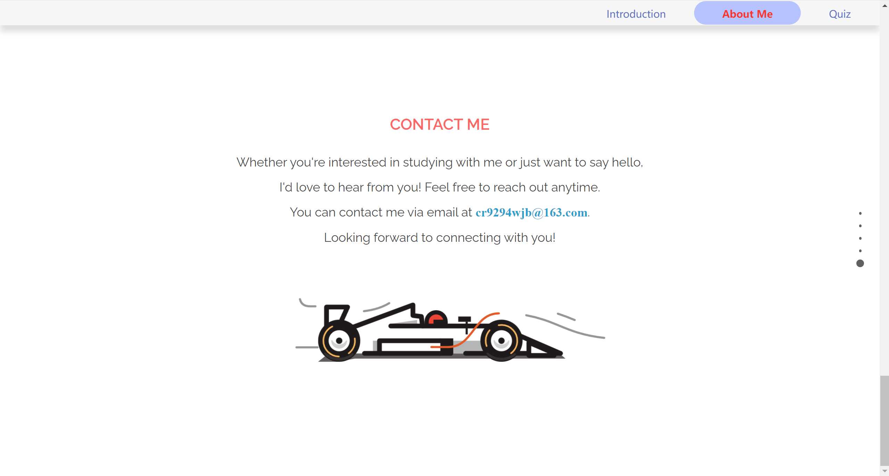
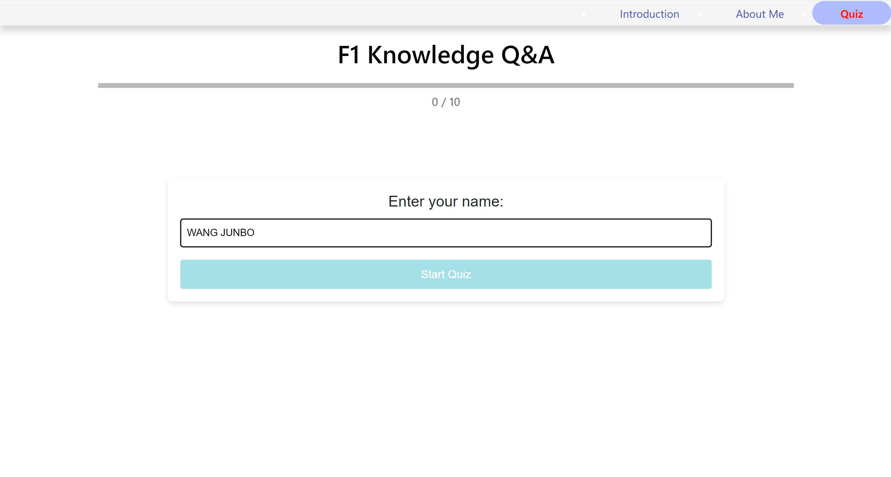
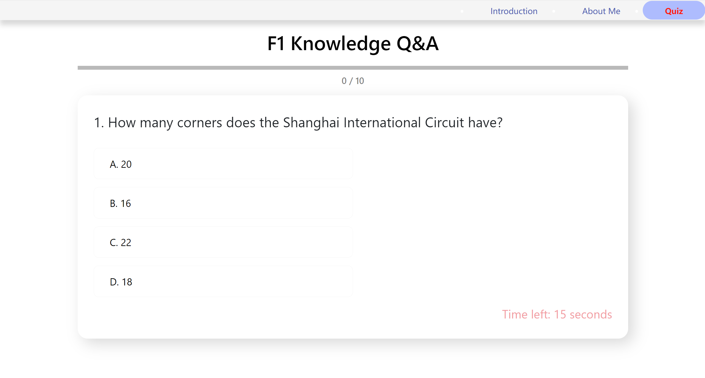
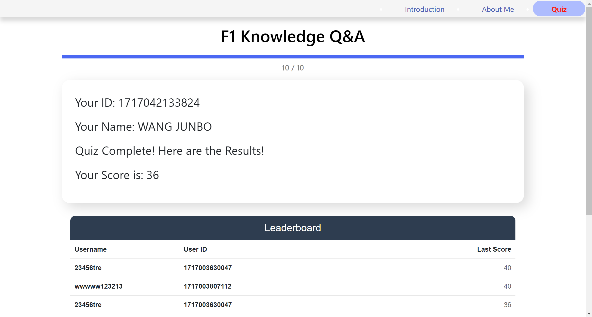
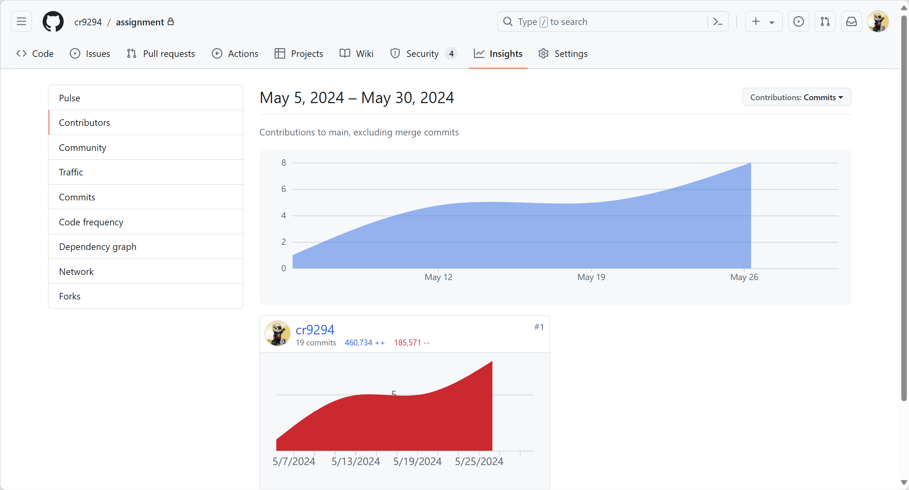
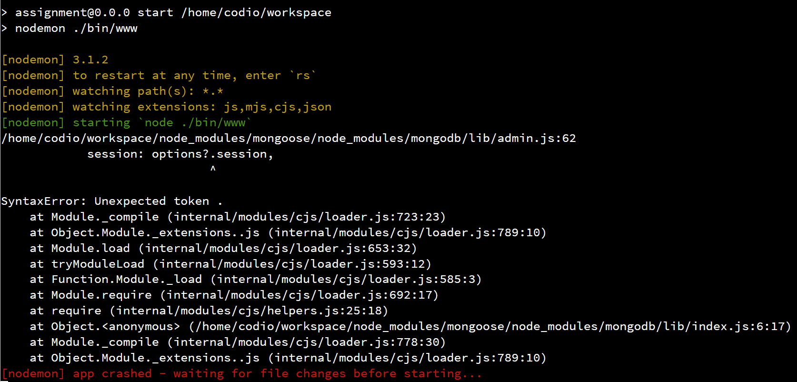

# README

# 1. 简介

这是一个基于 Node.js、Express、和 Socket.IO 构建的一个简单的网站，包含有关您自己的信息，以及一个交互式测验应用系统。

## 1.1 技术栈

- **Node.js**：运行 JavaScript 代码的服务器端环境。
- **Express**：Node.js 的 Web 应用框架，用于构建 API 和处理 HTTP 请求。
- **Socket.IO**：用于实现实时通信功能。
- **MongoDB**：NoSQL 数据库，用于存储用户答案和分数。（因为版本问题，作业上改为存储在 codio 上）
- **Mongoose**：Node.js 的 MongoDB 对象建模工具。
- **EJS**：模板引擎，用于生成 HTML 页面。
- **Morgan**：HTTP 请求日志中间件。

## 1.2 项目目录

```
/online-quiz
|-- /bin
|   |-- www.js
|-- /data
|   |-- answer.json
|   |-- questions.json
|-- /node_modules
|-- /public
|   |-- /images
|   |-- /javascripts
|   |-- /stylesheets
|-- /routes
|   |-- index.js
|   |-- form.js
|   |-- users.js
|   |-- test.js
|   |-- Answer.js
|-- /views
|   |-- error.ejs
|   |-- index.ejs
|   |-- users.ejs
|   |-- form.ejs
|   |-- test.ejs
|-- app.js
|-- package.json
|-- package-lock.json
|-- README.md
```

## 1.3 项目结构

项目主要文件和目录结构如下：

- `app.js`: 主应用文件，配置 Express 和 Socket.IO。
- `routes/`: 包含应用的路由模块。
- `views/`: 存放模板文件，使用 EJS 作为模板引擎。
- `public/`: 存放静态文件（如 CSS、JavaScript 和图片）。
- `data/`: 存储应用数据的 JSON 文件。

## 1.4 启动服务器

##### 1. **安装 Node.js 和 npm**

请确保系统中已经安装了 [Node.js](https://nodejs.org/) 和 npm（Node 包管理器）。

##### 2. **安装依赖**

在项目根目录运行以下命令安装所需的依赖：（已经完成，生成 node_modules 包）

##### 3. **启动服务器**

在项目根目录运行以下命令启动服务器：

服务器将会在 `http://localhost:3000` 启动。

配置 `BOX URL` 的端口号为 3000，点击 `BOX URL` 即可启动界面

# 2. 服务端

## 2.1 简介

本项目的服务端使用 [Express](https://expressjs.com/) 框架构建，并通过 [Socket.IO](https://socket.io/) 实现实时通信。服务端的主要功能包括处理 HTTP 请求、静态文件服务、存储和读取数据，以及处理用户提交的答案和生成排行榜。

## 2.2 主要功能

1. **路由**

   - `/`: 首页路由。
   - `/form`: 表单提交路由。
   - `/users`: 用户相关路由。
   - `/test`: 测试路由。
2. **静态文件服务**

通过 `express.static` 中间件提供 `public` 目录下的静态文件。

1. **数据存储**

使用 `fs-extra` 模块在 `data/answers.json` 文件中存储用户提交的答案。

1. **Socket.IO 实时通信**

   - 连接和断开通知。
   - 处理用户提交的答案并保存到本地 JSON 文件。
   - 响应客户端的排行榜请求，根据用户的得分生成排行榜并发送给客户端。
2. **错误处理**

   - 配置了基本的错误处理机制，包括 404 错误和一般性错误处理。

## 2.3 主要代码

简化后的主要代码段：

```javascript
var express = require('express');
var path = require('path');
var fs = require('fs-extra');
var http = require('http');
var socketIo = require('socket.io');
var app = express();
var server = http.createServer(app);
var io = socketIo(server);

// 读取和写入 JSON 文件的函数
async function readData() { /* ... */ }
async function writeData(data) { /* ... */ }

app.use(express.static(path.join(__dirname, 'public')));
app.get('/questions', (req, res) => { /* ... */ });

io.on('connection', (socket) => {
  socket.on('answer', async (data) => { /* ... */ });
  socket.on('requestLeaderboard', async () => { /* ... */ });
});

server.listen(3000, () => {
  console.log('Server is running on http://localhost:3000');
});
```

# 3. 页面设计

## 3.1 Introduction

这是网站的主页，包含欢迎信息和一些互动元素。页面使用了 Bootstrap 进行样式和布局的优化，并引入了自定义 CSS 和 JavaScript 文件来实现特定的效果。

### 3.1.1 文件结构

- `index.ejs`： 首页的模板文件，用于生成欢迎页面。
- `style.css` 和 `index.css`： 首页的样式文件。
- `script.js` 和 `index.js`： 首页的 JavaScript 文件。

### 3.1.2 页面元素

- **导航栏**：包含了链接到其他页面的菜单，用户可以点击导航栏快速切换到其他页面。

  - `Introduction`： 主页链接，指向 `/`。
  - `About Me`： 个人介绍页面链接，指向 `/users`。
  - `Quiz`： 问答页面链接，指向 `/form`。。
- **欢迎信息**：

  - `typing`： 一个动态显示欢迎词的区域，使用 JavaScript 控制文字动画效果。
  - `h1`： 标题，显示用户的名字。
- **插图部分**：

  - 包含两种情景的图像：室内和户外，通过点击选项来切换展示不同的情景和对应的物品。
- **选项切换**：

  - `option-wrapper`： 包含两个选项按钮，分别表示用户喜欢的活动类型：“I like staying at home。 ” 和 “I also enjoy traveling.  ”。
  - 点击不同的选项按钮，页面会切换对应的插图和背景。



### 3.1.3 功能说明

- 动态欢迎词：

  - 使用 JavaScript 和 Anime.js 实现打字效果，在页面加载时动态显示欢迎词。
- 情景切换：

  - 用户可以通过点击选项来切换显示不同的情景插图，使用 jQuery 监听点击事件并切换显示内容。
- 响应式设计：

  - 使用 Bootstrap 实现响应式设计，使页面在不同设备上均能正常显示。

### 3.1.4 引入的库

- Bootstrap:

  - 用于布局和响应式设计。
  - 引入了 Bootstrap 的 CSS 和 JS 文件。
- Anime.js:

  - 用于实现动画效果。
- jQuery:

  - 简化 DOM 操作，监听用户交互事件。

## 3.2 About me

这是一个关于我的页面，展示了个人的介绍、技能、项目、照片和联系方式等内容。页面采用了全屏滚动效果，通过 FullPage.js 库实现。

### 3.2.1 文件结构

- `users.ejs`： 关于我的页面的模板文件，用于展示个人信息和技能等内容。
- `game.css`， `user.css`， `anime.css`， `skill.css`， `contract.css`， `language.css`， `style.css`： 页面使用的样式文件。
- `fullpage.js`， `main.js`， `nav.js`， `smooth.js`， `typing.js`， `game.js`， `language.js`， `contract.js`： 页面使用的 JavaScript 文件。

### 3.2.2 页面元素

- **导航栏**：包含了链接到其他页面的菜单，用户可以点击导航栏快速切换到其他页面。

  - `Introduction`： 主页链接，指向 `/`。
  - `About Me`： 个人介绍页面链接，指向 `/users`。
  - `Quiz`： 问答页面链接，指向 `/form`。
- **主页部分**：

  - 写出我是谁
    
- **关于我展示**：

  - 包含了个人介绍、照片和一些个人爱好等内容。同时也展示了个人的技能水平，包括 Python、HTML、CSS、JavaScript、Vue 等技能的熟练程度。
    
- **项目展示**：

  - 展示了个人参与过的项目，包括项目名称和简要描述。
    
- **照片展示**：

  - 展示了个人拍摄的一些照片，包括照片的地点信息。
    
- **联系方式**：

  - 提供了个人的邮箱地址，方便用户与作者联系。
    

### 3.2.3 功能说明

- 全屏滚动：

  - 使用 FullPage.js 库实现了全屏滚动效果，使页面内容以分页的形式展示。
- 动画效果：

  - 使用了 Wow.js 库来实现页面元素的动画效果，提升了页面的交互体验。
- 技能展示：

  - 使用了 Skill Bar 效果展示了个人的技能水平，让用户直观了解作者的技能掌握情况。

### 3.2.4 引入的库

- **FullPage.js:**

  - 用于实现全屏滚动效果。
- **Owl Carousel:**

  - 用于创建照片展示的轮播效果。
- **Wow.js:**

  - 用于实现页面元素的动画效果。

## 3.3 Quiz

这是一个有关 F1 知识的在线测验页面，包含多个选择题，用户可以通过输入姓名并回答问题来进行测试。页面包括计时器、进度条、以及完成测验后的排行榜。

### 3.3.1 文件结构

- `form.ejs `:   在线测验页面的模板文件，用于实现在线测试。
- `style.css`,  `form.css`, `leaderboard.css`, `startquiz.css`:  页面使用的样式文件。
- `form.js`,   `script.js`： 页面使用的 JavaScript 文件。

### 3.3.2 页面元素

- **导航栏**：包含了链接到其他页面的菜单，用户可以点击导航栏快速切换到其他页面。

  - `Introduction`： 主页链接，指向 `/`。
  - `About Me`： 个人介绍页面链接，指向 `/users`。
  - `Quiz`： 问答页面链接，指向 `/form`。
- **主内容**:

  - **标题**: “F1 Knowledge Q&A”
  - **测验容器**: 包含问题、选项、倒计时和排行榜等元素。
    
- **测验部分**:

  - **进度条**: 显示用户的答题进度。
  - **问题和选项**: 显示当前的问题及其选项。
  - **倒计时**: 显示剩余回答时间。
  - **排行榜**: 显示测验结束后的排行榜。
    
    

### 3.3.3 功能说明

- **初始化测验**: 通过 `quizInit` 函数初始化测验，显示开始屏幕并建立与服务器的连接。
- **显示开始屏幕**: 用户输入姓名并点击开始按钮开始测验。
- **开始测验**: 输入姓名后，开始测验，更新进度条并渲染第一个问题。
- **渲染问题**: 根据当前问题和选项更新页面内容，并启动计时器。
- **计时器功能**: 设置 15 秒的倒计时，时间到或用户回答后显示正确答案并提供“下一题”按钮。
- **记录答案**: 用户点击选项按钮后记录答案并发送给服务器，同时更新总分数。
- **显示正确答案**: 在用户回答或时间到时显示正确答案，并提供反馈信息。
- **显示下一题按钮**: 用户回答问题或时间到后显示“下一题”按钮。
- **处理下一题**: 用户点击“下一题”按钮后，渲染下一个问题或显示测验结果。
- **显示结果**: 显示用户的测验结果，包括用户 ID、姓名和总分数，并请求服务器提供排行榜数据。
- **显示排行榜**: 从服务器获取排行榜数据并显示在页面上。

### 3.3.4 引入的库

- **Bootstrap CSS**:

  - 用于页面布局和样式。
- **jQuery**:

  - 用于简化 JavaScript 操作。
- **Socket.IO**:

  - 用于实现实时通信功能。
- **Popper.js 和 Bootstrap JS**:

  - 用于实现一些交互效果。


# 4. 版本控制

通过将项目推送到 GitHub 并使用 Git 进行版本控制，可以有效地管理项目的代码版本，避免开发过程中的冲突和混乱。

## 4.1 概述

本项目包含一个开发环境的配置文件夹 `.idea`，由 IntelliJ IDEA 等 JetBrains 系列 IDE 创建，用于存储项目的配置信息。项目的版本控制由 `.gitignore` 和 `vcs.xml` 文件指示，该项目正在使用 Git 进行版本控制，同时推送到 GitHub 远程仓库并进行版本控制管理。

## 4.2 文件说明

1. **.gitignore**
   - 列出了应被 Git 忽略的文件和目录，避免将这些不必要的文件提交到版本控制系统中。
2. **assignment.iml**
   - IntelliJ IDEA 模块文件，包含项目模块的配置信息。
3. **inspectionProfiles**
   - 包含代码检查配置文件，定义代码风格、错误检测和其他代码质量检查的规则。
4. **jsLibraryMappings.xml**
   - 定义了 JavaScript 库的映射，用于 Web 开发项目，帮助 IDE 识别和处理 JavaScript 依赖。
5. **material_theme_project_new.xml**
   - 与项目的 UI 主题设置相关，定义了项目使用的材质主题。
6. **modules.xml**
   - 包含项目中各个模块的信息，用于组织和管理项目的模块化结构。
7. **vcs.xml**
   - 包含版本控制系统的配置信息，指示项目使用的版本控制系统（例如 Git）。
8. **webResources.xml**
   - 包含 Web 资源的配置，指定项目中使用的各种 Web 资源（如 HTML、CSS、JavaScript 文件等）。

## 4.3 版本控制策略

1. **使用 .gitignore 文件**
   - 确保 `.gitignore` 文件包含所有不必要提交到仓库的文件和目录。例如：

     ```gitignore
     # IntelliJ IDEA
     .idea/
     *.iml

     # 编译输出
     /out/
     /build/

     # 日志文件
     *.log

     # 操作系统生成的文件
     .DS_Store
     Thumbs.db
     ```

2. **提交信息规范**
   - 使用有意义的提交信息，便于后期维护和版本回溯。例如：
     ```bash
     git commit -m "Fix bug in user authentication"
     ```

3. **定期推送和拉取**
   - 定期将本地更改推送到 GitHub 远程仓库，并从远程仓库拉取更新，确保代码库的一致性。



# 5. 疑难点

为了避免由于 Node.js 版本问题导致的 MongoDB 包不兼容问题，我们决定改用 fs-extra 组件进行本地存储。MongoDB 依赖于特定版本的 Node.js，如果 Node.js 版本与 MongoDB 包版本不匹配，可能会导致项目无法正常运行或出现各种兼容性错误。

## 报错信息

从报错信息中可以看出，错误发生在加载 mongodb 模块时，特别是在解析 JavaScript 代码时出现了语法错误。该错误可能是由于 MongoDB 依赖的代码中使用了某些 Node.js 版本不支持的语法特性，导致在当前环境中无法正确解析和运行。

通过使用 fs-extra 进行文件系统操作，我们可以完全绕过这种依赖性问题。fs-extra 是一个轻量级的文件系统操作库，与 Node.js 的版本兼容性更广泛和稳定。这样一来，我们可以保证数据存储和读取的可靠性和一致性，避免由于依赖库版本冲突带来的不必要麻烦。

此外，使用 fs-extra 还简化了开发和部署过程。我们不再需要担心 MongoDB 和 Node.js 之间的版本兼容性问题，从而能够更专注于业务逻辑的实现。同时，fs-extra 提供了丰富的文件系统操作功能，使得文件操作更加简便和高效。

总之，改用 fs-extra 进行本地存储，不仅解决了 MongoDB 包与 Node.js 版本不兼容的问题，还提升了系统的稳定性和开发效率。

# 6. Reference

1. **Node.js Documentation**
   Official documentation for Node.js, providing details on how to set up and use the runtime environment for server-side JavaScript.
   - [Website: Node.js Documentation](https://nodejs.org/en/docs/)

2. **Express Documentation**
   Comprehensive guide and API reference for Express, a popular web framework for Node.js.
   - [Website: Express Documentation](https://expressjs.com/)

3. **Socket.IO Documentation**
   Official documentation for Socket.IO, a library for enabling real-time, bidirectional communication between web clients and servers.
   - [Website: Socket.IO Documentation](https://socket.io/docs/)

4. **MongoDB Documentation**
   Detailed guides and API references for MongoDB, a NoSQL database program.
   - [Website: MongoDB Documentation](https://docs.mongodb.com/)

5. **Mongoose Documentation**
   Official documentation for Mongoose, a MongoDB object modeling tool designed to work in an asynchronous environment.
   - [Website: Mongoose Documentation](https://mongoosejs.com/docs/)

6. **EJS Documentation**
   Documentation for EJS, a simple templating language that lets you generate HTML markup with plain JavaScript.
   - [Website: EJS Documentation](https://ejs.co/#docs)

7. **Morgan Documentation**
   Middleware library for logging HTTP requests in Node.js applications.
   - [Website: Morgan Documentation](https://github.com/expressjs/morgan)

8. **Bootstrap Documentation**
   Official guide and documentation for Bootstrap, a framework for building responsive, mobile-first websites.
   - [Website: Bootstrap Documentation](https://getbootstrap.com/docs/)

9. **Anime.js Documentation**
   Official documentation for Anime.js, a lightweight JavaScript animation library.
   - [Website: Anime.js Documentation](https://animejs.com/documentation/)

10. **jQuery Documentation**
    Comprehensive documentation for jQuery, a fast and feature-rich JavaScript library.
    - [Website: jQuery Documentation](https://jquery.com/)

11. **FullPage.js Documentation**
    Official documentation for FullPage.js, a library to create fullscreen scrolling websites.
    - [Website: FullPage.js Documentation](https://alvarotrigo.com/fullPage/)

12. **Owl Carousel Documentation**
    Documentation for Owl Carousel, a jQuery plugin for creating responsive carousel sliders.
    - [Website: Owl Carousel Documentation](https://owlcarousel2.github.io/OwlCarousel2/)

13. **Wow.js Documentation**
    Official documentation for Wow.js, a JavaScript library for revealing animations when you scroll.
    - [Website: Wow.js Documentation](https://wowjs.uk/docs.html)
